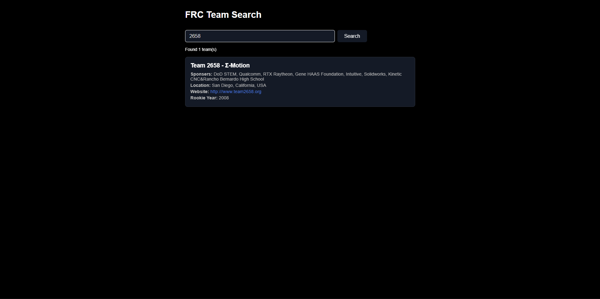

# FRC Overview Website
A website to view statistics about FRC teams

Live demo available on [Github Pages](https://word9317.github.io/FRCOverviewWebsite/)
## Features
 - Search teams by team number or by name
 - Details page that has pictures

## Techstack
* HTML
* JS
* CSS
* Vite
* TheBlueAlliance API v3
> idk what im doing since i come from normal html, js, css. vite is kinda confusing

## Usage
1. Clone gh repo
```
git clone https://github.com/word9317/FRCOverviewWebsite.git
cd FRCOverviewWebsite
```
2. Node stuff
```
npm install
```
3. sell your soul to TheBlueAlliance(get an api key)
* Go to [the blue alliance](https://www.thebluealliance.com/)
* Create an account and get your api key
* Create a .env key in the root directory of this repo, replace yourApiKey with the api key you stole(acquired) from thebluealliance
```
VITE_XTBAAUTHKEY=your_actual_tba_api_key_here
```
4. Run this epic project
```
npm run dev
```